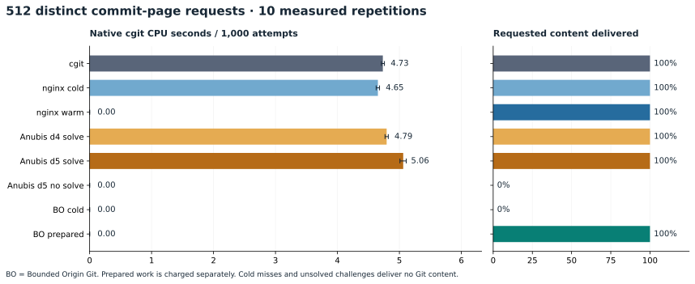
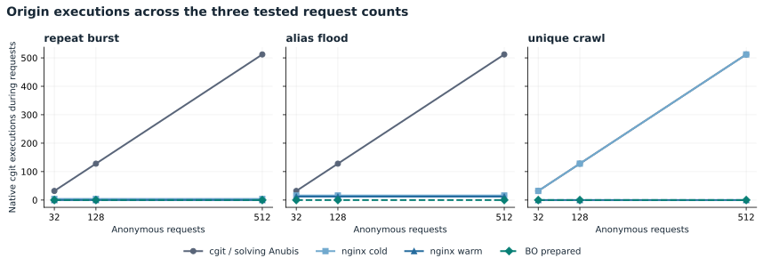
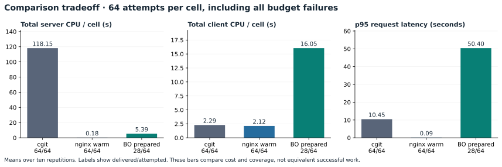
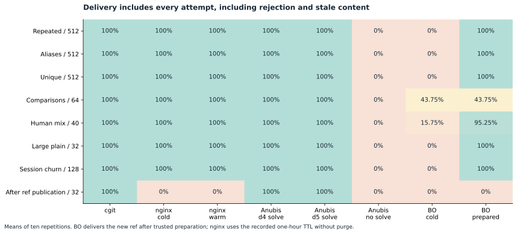
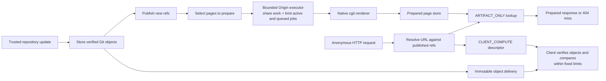

# Bounded Origin Git

Bounded Origin Git is a Git/cgit application built on the released
[Bounded Origin](https://github.com/aalsanie/bounded-origin) libraries. It renders
selected cgit pages ahead of time. Anonymous requests read the saved pages, and a
missing page returns 404 without starting cgit. This repository contains the
integration and its measured comparison with cgit, nginx and Anubis.

Across **47,200 measured [Bounded Origin](https://github.com/aalsanie/bounded-origin) attempts**, anonymous requests caused **zero native cgit executions**. For the 512-page unique crawl, prepared BO delivered **512/512 representations** in every measured repetition, again with zero request-triggered cgit.



## What the campaign establishes

The [“Creepy crawlies” problem](https://people.kernel.org/monsieuricon/creepy-crawlies) is repeated cgit work driven by scraper requests; here, anonymous reads serve prepared pages without starting cgit.

For **512 unique pages** from a Linux v6.12 dataset, these are ten-run averages with 95% confidence intervals; latency includes misses and challenges.

<!-- generated:unique -->

| Configuration | Native cgit executions | Native CPU s / 1,000 attempts (95% CI) | Delivered | p95 latency (ms) |
| --- | --- | --- | --- | --- |
| cgit | 512 | 4.733 [4.710, 4.758] | 100% | 248.8 |
| nginx cold | 512 | 4.653 [4.625, 4.679] | 100% | 261.8 |
| nginx warm | 0 | 0.000 [0.000, 0.000] | 100% | 22.3 |
| Anubis d4 solve | 512 | 4.794 [4.768, 4.821] | 100% | 256.2 |
| Anubis d5 solve | 512 | 5.062 [5.008, 5.111] | 100% | 162.6 |
| Anubis d5 no solve | 0 | 0.000 [0.000, 0.000] | 0% | 16.9 |
| BO cold | 0 | 0.000 [0.000, 0.000] | 0% | 41.8 |
| BO prepared | 0 | 0.000 [0.000, 0.000] | 100% | 37.9 |

<!-- /generated:unique -->

`BO prepared` and `nginx warm` start prepopulated; `BO cold` returns 404 for missing pages, and unsolved Anubis challenges deliver no content.



For four pages expressed as sixteen URL aliases, BO prepares four pages and cold nginx renders sixteen with its configured raw-URL cache key.

## Costs and tradeoffs

Warm nginx was faster than BO for cached content; BO was also slower than direct cgit for large files.

<!-- generated:tradeoffs -->

| Workload / configuration | Delivered | Server CPU (s) | Client CPU (s) | p95 latency (ms) |
| --- | --- | --- | --- | --- |
| comparisons / cgit | 64.0 / 64 | 118.15 | 2.29 | 10,454.5 |
| comparisons / nginx warm | 64.0 / 64 | 0.18 | 2.12 | 90.9 |
| comparisons / BO prepared | 28.0 / 64 | 5.39 | 16.05 | 50,397.3 |
| human-mix / cgit | 40.0 / 40 | 1.03 | 0.20 | 37.1 |
| human-mix / nginx warm | 40.0 / 40 | 0.01 | 0.21 | 4.8 |
| human-mix / BO prepared | 38.1 / 40 | 0.56 | 0.40 | 370.9 |
| large-plain / cgit | 32.0 / 32 | 1.04 | 0.73 | 150.4 |
| large-plain / nginx warm | 32.0 / 32 | 0.05 | 0.76 | 61.7 |
| large-plain / BO prepared | 32.0 / 32 | 1.33 | 1.15 | 269.3 |

<!-- /generated:tradeoffs -->

All values are ten-run averages, including each run's p95.



BO completed **28/64 comparisons (43.75%)**; the rest hit fixed client limits, with a **50.4-second p95** across all attempts. See the [pair-by-pair results](BENCHMARKS.md#comparison-coverage).

Session churn used **32.05 client CPU seconds per 128 requests** for Anubis d5 solving, versus **0.60** for prepared BO (Node clients).

## Preparation cost

<!-- generated:ingestion -->

Ingesting 158,681 objects into a fresh store averaged **12.91 minutes** (10.79–13.25) and 106.40 server CPU seconds, using **1.044 GiB** of allocated disk space before page preparation.

<!-- /generated:ingestion -->

HTML preparation costs for the same 512-request cells:

<!-- generated:preparation -->

| Preparation for 512-request cell | CGI executions | Wall time (s) | Native CPU (s) | Server CPU (s) |
| --- | --- | --- | --- | --- |
| repeat-burst / nginx warm | 4 | 0.11 | 0.025 | 0.107 |
| repeat-burst / BO prepared | 4 | 0.33 | 0.042 | 0.411 |
| alias-flood / nginx warm | 4 | 0.11 | 0.025 | 0.107 |
| alias-flood / BO prepared | 4 | 0.33 | 0.042 | 0.410 |
| unique-crawl / nginx warm | 512 | 12.44 | 2.195 | 12.354 |
| unique-crawl / BO prepared | 512 | 25.02 | 3.087 | 18.577 |

<!-- /generated:preparation -->

Preparing all 512 unique pages required **512 trusted renders**; preparation plus the first request batch used more server CPU than one direct cgit batch.

## Admission and ref updates

In each of ten measured control repetitions:

| Control | Observed result |
| --- | --- |
| 64 simultaneous submissions of one operation | 1 native execution; 63 callers joined; 64 successful completions |
| 64 distinct submissions | 18 admitted, 46 rejected; native concurrency never exceeded 2 |
| Four delayed jobs | All timed out; real children terminated; no artifact published |
| Injected CGI failure, then four retries | One failed execution; all retries rejected during cooldown; no artifact published |

Limits: **2 active jobs, 16 queued, a 5-second execution timeout and 500 ms cooldown**. All baselines also capped native concurrency at two.

<!-- generated:resources -->

Peak server memory: **178.5 MiB for BO**, **495.9 MiB for cgit**; BO client peak: **418.2 MiB**. These are observed cgroup maxima across workloads, including preparation and page cache, excluding ingestion.

<!-- /generated:resources -->

After a ref update, BO returned misses until new pages were prepared; nginx served stale content in **320/320 requests per configuration** with a one-hour TTL and no purge.



## Request flow



Built on released **[Bounded Origin 0.1.0](https://github.com/aalsanie/bounded-origin#usage)** artifacts from Maven Central. See the [benchmark application](src/benchmark/java/io/github/aalsanie/boundedorigingit/benchmark/BenchmarkApplication.java) for the integration.

## Reproduce

Use Java 21, Node 22, Python 3.11 or newer and Git:

```sh
./gradlew clean check benchmarkBundle
```

On Windows:

```powershell
.\gradlew.bat clean check benchmarkBundle
```

Regenerate tables and charts from the [recorded evidence](benchmarks/results/2026-10-03):

```sh
python -m pip install -r benchmarks/plot-requirements.txt
python benchmarks/publish.py benchmarks/results/2026-10-03
```

Full campaign setup and commands: [protocol](benchmarks/protocol.md#running). Full results and methods: [benchmark report](BENCHMARKS.md).
