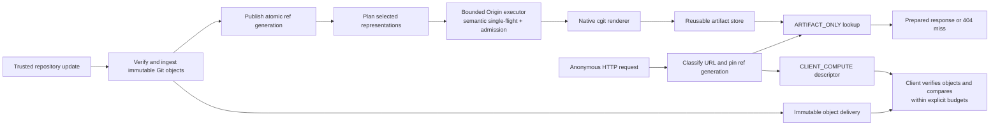

# Bounded Origin Git

Git/cgit integration for [Bounded Origin](https://github.com/aalsanie/bounded-origin): prepare reusable pages through a trusted, bounded producer, serve them by semantic identity, and move supported two-sided comparisons to a bounded client engine.

**512 distinct commit-page requests, 512 correct deliveries, zero request-triggered cgit executions.** That result held in every one of ten measured repetitions against a Linux v6.12 dataset. Direct cgit and both solving Anubis configurations executed cgit 512 times per repetition. Preparation is real work and is accounted for below.

**The limit matters too:** the client engine delivered only **28 of 64 comparisons (43.75%)** in each comparison repetition. The remaining requests exceeded explicit budgets. This is evidence of controlling origin work, with measured coverage and latency costs.


## What the campaign establishes

The [“Creepy crawlies” account](https://people.kernel.org/monsieuricon/creepy-crawlies) describes scraper demand turning cheap URLs into repeated cgit rendering and traversal, even after clients solve proof-of-work. This integration changes who can authorize that computation: anonymous reads cannot start the native renderer. It does not identify crawlers or eliminate HTTP, storage, transfer, or client costs.

The October 3, 2026 campaign compared **eight configurations, eight workloads, three burst sizes, two warmup repetitions and ten measured repetitions**: 1,344 cells, plus admission and failure controls. The dataset contained 158,681 Git objects, with a 128-commit catalogue across four repository namespaces sharing one history. It is a depth-32 clone, not the complete Linux history or a reproduction of kernel.org traffic.

For **512 unique commit-page requests**, the following values are repetition means. Confidence intervals are seeded 95% bootstrap intervals over the ten repetitions. Latency includes all outcomes, including misses and challenges.

<!-- generated:unique -->

| Configuration | Native cgit executions | Native CPU s / 1,000 attempts (95% CI) | Delivered | p95 latency (ms) |
| --- | --- | --- | --- | --- |
| cgit | 512 | 4.733 [4.710, 4.758] | 100% | 248.8 |
| nginx cold | 512 | 4.653 [4.625, 4.679] | 100% | 261.8 |
| nginx warm | 0 | 0.000 [0.000, 0.000] | 100% | 22.3 |
| Anubis d4 solve | 512 | 4.794 [4.768, 4.821] | 100% | 256.2 |
| Anubis d5 solve | 512 | 5.062 [5.008, 5.111] | 100% | 162.6 |
| Anubis d5 no solve | 0 | 0.000 [0.000, 0.000] | 0% | 16.9 |
| BO cold | 0 | 0.000 [0.000, 0.000] | 0% | 41.8 |
| BO prepared | 0 | 0.000 [0.000, 0.000] | 100% | 37.9 |

<!-- /generated:unique -->

`BO prepared` and `nginx warm` start with the selected content prepopulated. `BO cold` has ingested Git objects but no prepared HTML; a miss returns 404 without rendering. Unsolved Anubis challenges also avoid native work and deliver no Git content. Those outcomes are not counted as successful responses.

Across **47,200 measured BO attempts**, the native process events and adapter counters both recorded **zero anonymous render calls**. This includes misses and rejected comparisons. Prepared commit, alias, session-churn and large-plain workloads delivered every requested representation. The [delivery chart](benchmarks/results/2026-10-03/generated/delivery.svg) shows where coverage fell short.


The ordinary nginx cache is effective: four cold renders serve the repeated burst. The alias workload has four semantic operations expressed through sixteen raw URLs; nginx performs sixteen cold renders, or twelve additional renders after warming the four canonical URLs. BO prepares four semantic artifacts. This result depends on the configured raw-URI nginx cache key; semantic cache keys could remove this alias penalty.

The unique crawl exposes the boundary: a cold cache computes all 512 operations, while BO refuses absent artifacts. After trusted preparation, both warm systems avoid request-time rendering. Serving prepared content is useful; serving a miss is an explicit availability tradeoff.

## Costs and unfavorable results

Warm nginx was faster and used less request-phase server CPU than BO for cached content in this campaign. BO's fresh JVM, gateway, artifact lookup and client-module setup have visible costs. The large plain-file workload was also slower than direct cgit. These finite-session measurements include runtime warmup after process startup; they are not steady-state capacity estimates.

<!-- generated:tradeoffs -->

| Workload / configuration | Delivered | Server CPU (s) | Client CPU (s) | p95 latency (ms) |
| --- | --- | --- | --- | --- |
| comparisons / cgit | 64.0 / 64 | 118.15 | 2.29 | 10,454.5 |
| comparisons / nginx warm | 64.0 / 64 | 0.18 | 2.12 | 90.9 |
| comparisons / BO prepared | 28.0 / 64 | 5.39 | 16.05 | 50,397.3 |
| human-mix / cgit | 40.0 / 40 | 1.03 | 0.20 | 37.1 |
| human-mix / nginx warm | 40.0 / 40 | 0.01 | 0.21 | 4.8 |
| human-mix / BO prepared | 38.1 / 40 | 0.56 | 0.40 | 370.9 |
| large-plain / cgit | 32.0 / 32 | 1.04 | 0.73 | 150.4 |
| large-plain / nginx warm | 32.0 / 32 | 0.05 | 0.76 | 61.7 |
| large-plain / BO prepared | 32.0 / 32 | 1.33 | 1.15 | 269.3 |

<!-- /generated:tradeoffs -->

Numbers above are means per cell over ten repetitions; p95 is the mean of each repetition's request p95, in milliseconds. Each human-mix cell has a different, paired seeded request sequence, so its mean delivered count can be fractional. Total server CPU includes the gateway/proxy and benchmark transport; native cgit CPU is measured separately with `wait4`.


Seven of the sixteen comparison pairs completed. Nine hit tree-entry, file-count, line-count or line-diff complexity limits. The default limits were preserved, and every failure stayed in the denominator. The BO comparison p95 was about **50 seconds**, including failures; moving work to the client does not make every comparison practical. Structured client results and native cgit HTML also have different presentation and transfer costs. See the [pair-by-pair outcomes and scope](BENCHMARKS.md#comparison-coverage).

Anubis d5 stopped the non-solving client from reaching cgit. Clients that solved the real d4 or d5 challenges subsequently caused the same native execution counts as direct cgit. In the session-churn workload, d5 solving used **32.05 client CPU seconds per 128 requests**, compared with **0.60** for prepared BO; this is Node on two allocated CPUs, not a mobile-browser timing claim. Proof-of-work throttles the offered load and can lower some per-request latency quantiles while increasing overall completion time.

## Preparation is part of the cost

<!-- generated:ingestion -->

Fresh ingestion of 158,681 objects took **12.91 minutes** on average (10.79–13.25), with 106.40 server CPU seconds. The loose-object store occupied 662.37 MiB of file content and 1.044 GiB of allocated filesystem space, before HTML artifacts. This cost is outside the request measurements and was paid afresh in every repetition.

<!-- /generated:ingestion -->

HTML preparation costs for the same 512-request cells:

<!-- generated:preparation -->

| Preparation for 512-request cell | CGI executions | Wall time (s) | Native CPU (s) | Server CPU (s) |
| --- | --- | --- | --- | --- |
| repeat-burst / nginx warm | 4 | 0.11 | 0.025 | 0.107 |
| repeat-burst / BO prepared | 4 | 0.33 | 0.042 | 0.411 |
| alias-flood / nginx warm | 4 | 0.11 | 0.025 | 0.107 |
| alias-flood / BO prepared | 4 | 0.33 | 0.042 | 0.410 |
| unique-crawl / nginx warm | 512 | 12.44 | 2.195 | 12.354 |
| unique-crawl / BO prepared | 512 | 25.02 | 3.087 | 18.577 |

<!-- /generated:preparation -->

The prepared unique crawl still needed **512 trusted renders**. Its first preparation plus request batch cost more server CPU than one direct batch, even before object ingestion. Savings come from reuse and restricting who initiates new work; they are not free computation or a first-visit speedup. This benchmark warms exactly the requested catalogue, so warm results describe available prepared content, not an arbitrary unseen crawl.

## Bounded admission, failure and ref updates

In each of ten measured control repetitions:

| Control | Observed result |
| --- | --- |
| 64 simultaneous submissions of one operation | 1 native execution; 63 callers joined; 64 successful completions |
| 64 distinct submissions | 18 admitted, 46 rejected; native concurrency never exceeded 2 |
| Four delayed jobs | All timed out; real children terminated; no artifact published |
| Injected CGI failure, then four retries | One failed execution; all retries rejected during cooldown; no artifact published |

The trusted executor was configured for **2 active jobs, 16 queued jobs, a 5-second execution timeout and 500 ms failure cooldown**. All configurations already capped native CGI concurrency at two. The evidence for BO is controlled admission and authority over new computation, not a comparison against an unbounded baseline. Every recorded cgroup finished empty, with no memory quota failure, OOM kill or task-limit event.

<!-- generated:resources -->

Maximum server cgroup memory across measured BO cells was **178.5 MiB**, versus **495.9 MiB** for direct cgit. BO client cgroups reached **418.2 MiB**. These are maxima across different workloads, including preparation and page cache; ingestion is separate. They demonstrate the observed resource envelope, not a general memory-efficiency ratio. The full report also retains sampled process RSS, native I/O, cache counters and wire bytes.

<!-- /generated:resources -->

After trusted ref publication, BO returned misses for the new generation until it was materialized, then delivered the new bytes. It never served the old generation under the new identity. Both nginx configurations served the cached old bytes for all 320 measured post-update requests each. This tests a one-hour TTL **without an update purge**; it is not a claim that nginx cannot invalidate content.


## Architecture and request flow



Git-specific identity, ref publication, object validation, cgit process management and comparison semantics live in this repository. The generic executor, policies, filesystem artifact store and HTTP gateway come from **released Bounded Origin 0.1.0 artifacts on Maven Central**. No generic runtime changes were needed for this application.

| Released Bounded Origin component | Application here |
| --- | --- |
| `bounded-origin-api`: `OperationKey`, `Budget`, `ArtifactStore`, `ClientComputation` | Semantic identities, producer limits, reusable representations and versioned comparison descriptions |
| `bounded-origin-core`: `BoundedOriginExecutor` | Shared work, bounded admission, timeout and failure cooldown through `CgitRenderExecutor` |
| `bounded-origin-store-fs`: `FileSystemArtifactStore` | Durable prepared cgit artifacts |
| `bounded-origin-proxy`: `BoundedOriginGateway`, policy routing | Artifact-only anonymous reads and client-compute responses in the measured application |

See the [upstream library and gateway usage](https://github.com/aalsanie/bounded-origin#usage) and this repository's [composition example](src/benchmark/java/io/github/aalsanie/boundedorigingit/benchmark/BenchmarkApplication.java). Dependency direction remains `bounded-origin-git → bounded-origin`; Git concepts do not enter the generic APIs.

## Build and use the integration

This repository currently provides Java integration components and JavaScript comparison modules. It does not ship a production hosting service or a published `bounded-origin-git` Maven release. The benchmark application demonstrates composition and contains privileged controls intended for its isolated test environment.

Use Java 21, Node 22, Python 3.11 or newer and Git:

```sh
./gradlew clean check benchmarkBundle
```

On Windows:

```powershell
.\gradlew.bat clean check benchmarkBundle
```

Linux native integration tests additionally need `cgit` (or `CGIT_EXECUTABLE`; `CGIT_LIBRARY_PATH` supports extracted packages). The complete campaign requires Python 3.12+, native Linux storage, cgroup v1 controllers and network-namespace privileges; see the [recorded protocol](benchmarks/protocol.md) before running it.

For an embedded application, use the components in this order:

1. Ingest verified objects through [`GitObjectStore`](src/main/java/io/github/aalsanie/boundedorigingit/git/GitObjectStore.java), then publish refs through [`RefGenerationStore`](src/main/java/io/github/aalsanie/boundedorigingit/git/RefGenerationStore.java). Treat update input as trusted authority, separate from HTTP callers.
2. Classify cgit requests with [`CgitSemanticClassifier`](src/main/java/io/github/aalsanie/boundedorigingit/cgit/CgitSemanticClassifier.java) and pin artifact identity to a ref snapshot. Use [`CgitRenderOnWriteCoordinator`](src/main/java/io/github/aalsanie/boundedorigingit/cgit/CgitRenderOnWriteCoordinator.java) to plan bounded preparation.
3. Materialize through [`CgitArtifactService`](src/main/java/io/github/aalsanie/boundedorigingit/cgit/CgitArtifactService.java), `CgitRenderExecutor` and `ProcessCgitRenderer`. Anonymous lookup must remain artifact-only; a miss grants no render authority. The [native integration test](src/test/java/io/github/aalsanie/boundedorigingit/cgit/NativeCgitTest.java) exercises the full object/ref/render lifecycle.
4. Route supported two-sided comparisons with [`CgitComparisonClientCompute`](src/main/java/io/github/aalsanie/boundedorigingit/cgit/CgitComparisonClientCompute.java). The client uses [`comparisonRequestFromCgitUrl`](src/main/resources/io/github/aalsanie/boundedorigingit/client/cgit-comparison-request-v1.mjs) and [`compareGit`](src/main/resources/io/github/aalsanie/boundedorigingit/client/cgit-compare-v1.mjs); its object reader must enforce transfer and decompression limits and honor cancellation.

Operators still own authentication for trusted updates, ingress and network limits, object-store retention and disk quotas, supported representation selection, and the user experience for unavailable or over-budget results. HTML artifacts were capped at 2 GiB in this campaign; the immutable object store grows with trusted ingestion and is not an anonymous on-demand clone service. Smart Git transport, browser DOM rendering, WAN latency and production deployment are outside this evidence.

## Inspect or reproduce the evidence

The [benchmark report](BENCHMARKS.md) contains the complete matrix, uncertainty, resource peaks, provenance, exclusions and exact reproduction steps. The committed [evidence package](benchmarks/results/2026-10-03) includes every request outcome, native process event, resource sample, control, preparation record and frozen source archive needed for the published tables. Warmups are retained and excluded from statistics.

```sh
python -m pip install -r benchmarks/plot-requirements.txt
python benchmarks/publish.py benchmarks/results/2026-10-03
```

This verifies evidence hashes and request-level statistics before regenerating the tables and SVG/PNG figures. All numbers here come from the corrected publication campaign. The earlier interrupted campaign is retained separately as diagnostic evidence and contributes no performance samples.
